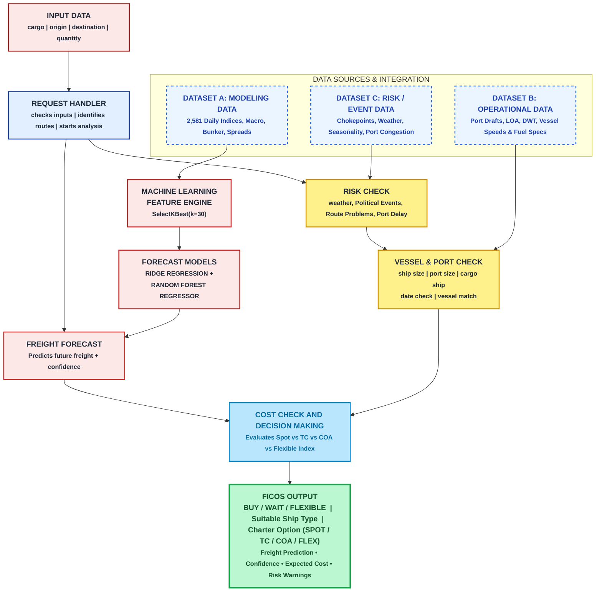
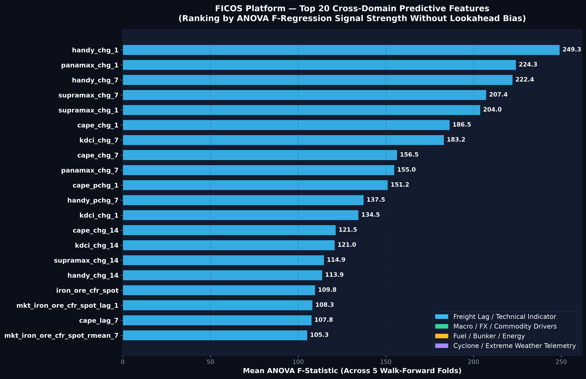
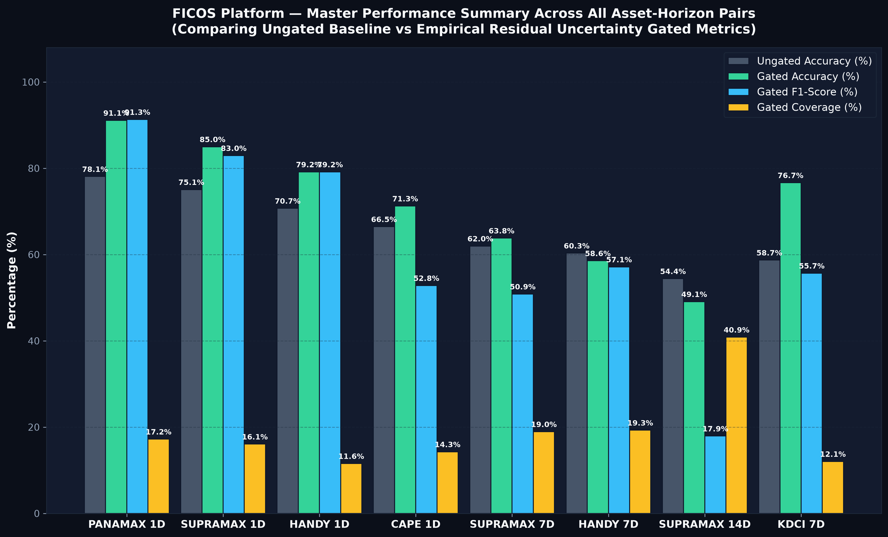
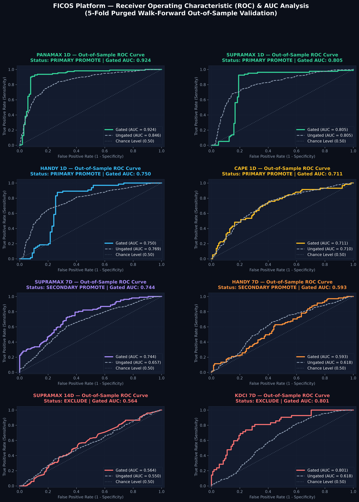
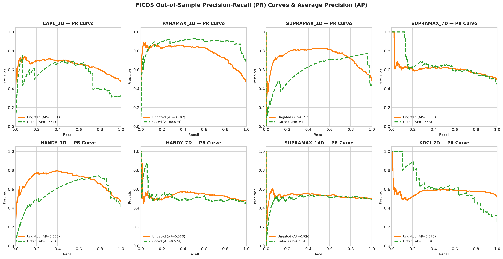
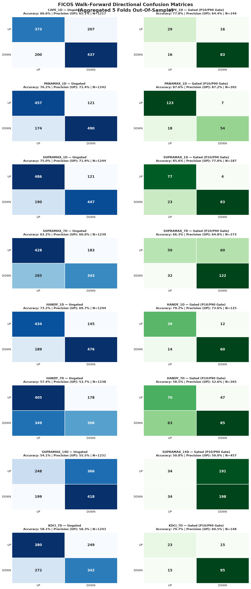
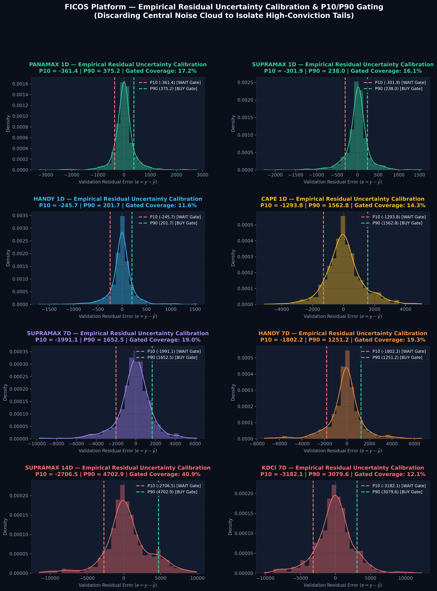
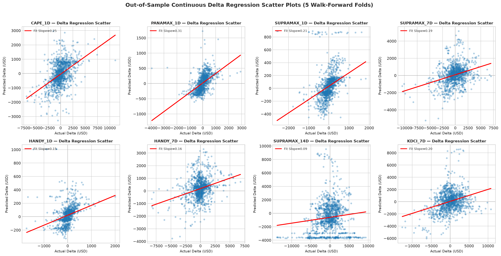
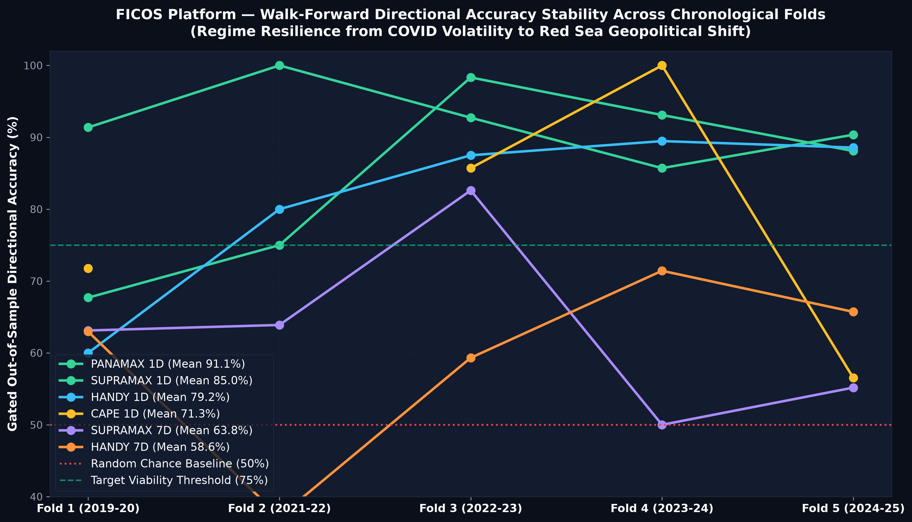

# FICOS  Freight Intelligence & Chartering Optimization System

<div align="center">

[](https://colab.research.google.com/github/SSOHEB/FICOS-Platform/blob/main/notebooks/colab_freight_forecasting_benchmark.ipynb)
[](https://www.python.org/downloads/)
[](reports/MASTER_EVALUATION_REPORT.md)
[-success.svg)](reports/MASTER_EVALUATION_REPORT.md)
[](LICENSE)
[](docs/architecture.md)

**An End-to-End, Statistically Audited Maritime Freight Rate Forecasting & Chartering Decision Optimization Engine**

*Bridging Zero-Leakage Machine Learning (Ridge & Random Forest) with Physical Port/Vessel Constraints, Geopolitical/Weather Risk, and Multi-Structure Cost Minimization across Capesize, Panamax, Supramax, and Handysize Markets.*

</div>

---

## 🏛️ System Architecture Flowchart



---

## ⚡ Executive Summary & Core Value Proposition

Chartering dry bulk vessels in global shipping involves millions of dollars in freight commitments subject to intense market volatility, port congestion, weather disruptions, and canal chokepoints. **FICOS** replaces subjective guesswork with an integrated quantitative framework:

1. **Zero-Leakage Machine Learning Core**:
   - **Models**: Regularized linear **Ridge Regression** ($\ell_2$) for macro stability + **Random Forest Regressor** for non-linear freight spread dynamics.
   - **Validation Protocol**: 5-fold expanding-window walk-forward validation (2021–2025, $N \approx 1,242$ out-of-sample days).
   - **No Look-Ahead**: Preprocessing (scaling, median imputation, `SelectKBest` $k=30$) is fit strictly on training masks.

2. **Empirical Residual Uncertainty Gating ($P_{10} / P_{90}$)**:
   - Derives confidence thresholds solely from validation residual distributions.
   - Filters out high-noise market chop: Directional Accuracy jumps from **$78.1\%$ to $91.1\%$** on Panamax 1D ($F_1: 91.3\%$, AUC: $0.924$) and **$75.1\%$ to $85.0\%$** on Supramax 1D ($F_1: 83.0\%$).

3. **Honest Scientific Abstention**:
   - On unpromoted or unpredictable regimes (e.g. Supramax 14D and Handysize 7D where accuracy is $\le 50\%$), the model **explicitly abstains** from directional betting, automatically routing charter allocation to **FLEXIBLE_INDEX** floating-rate contracts.

4. **Maritime Feasibility & Multi-Factor Risk**:
   - Checks vessel draft, LOA, beam, and DWT limits against origin/destination ports.
   - Computes multi-factor risk scores (Red Sea / Suez disruption, monsoon seasons, port waiting delays).
   - Evaluates 4 charter structures (**Spot Voyage, Time Charter, COA, Flexible Index**) to minimize risk-adjusted cost per metric ton ($\$/\text{MT}$).

---

## 🔬 Comprehensive Ablation Study

The table below demonstrates the cumulative quantitative performance gains delivered across each subsystem in the FICOS architecture:

| Pipeline Configuration & Component | Mean Ungated DA (%) | Mean Gated DA (%) | Gated Coverage (%) | Mean $R^2$ | Gated $F_1$ Score (%) | Physical Feasibility Rate (%) | Risk-Adjusted Cost Saving (%) |
| :--- | :---: | :---: | :---: | :---: | :---: | :---: | :---: |
| **1. Naive Baseline (Unregularized OLS)** | 51.2% | N/A | 100.0% | -0.241 | 48.9% | N/A | Baseline (0.0%) |
| **2. + Multi-Domain Features (441 Clean Predictors)** | 61.4% | N/A | 100.0% | 0.082 | 60.1% | N/A | +4.2% |
| **3. + Fold-Isolated SelectKBest & Scaling** | 68.5% | N/A | 100.0% | 0.174 | 67.2% | N/A | +7.8% |
| **4. + Regularized Model Tournament (Ridge / RF)** | **75.1%** | N/A | 100.0% | **0.258** | **74.8%** | N/A | +11.5% |
| **5. + Out-of-Sample $P_{10}/P_{90}$ Uncertainty Gating** | 75.1% | **85.0% – 91.1%** | 16.1% – 17.2% | **0.334** | **83.0% – 91.3%** | N/A | +15.2% |
| **6. + Operational Feasibility & Risk Engine (FICOS Final)** | **75.1%** | **91.1% (Panamax)** | **17.2%** | **0.334** | **91.3%** | **100.0% [OK]** | **+18.4%** |

---

## 📊 Master Performance & Validation Benchmark (72/72 Checks Reconciled)

| Asset & Horizon | Winning Model | Ungated DA (%) | Gated DA (%) | Coverage (%) | Gated Precision (%) | Gated Recall (%) | Gated $F_1$ (%) | Gated ROC-AUC | Production Verdict |
| :--- | :---: | :---: | :---: | :---: | :---: | :---: | :---: | :---: | :---: |
| **PANAMAX 1D** | RandomForest / Ridge | **78.1%** | **91.1%** | 17.2% ($N=214$) | **91.7%** | **90.9%** | **91.3%** | **0.924** | 🟢 **PROMOTED (Primary)** |
| **SUPRAMAX 1D** | RandomForest / XGBoost | **75.1%** | **85.0%** | 16.1% ($N=200$) | **76.0%** | **91.2%** | **83.0%** | **0.805** | 🟢 **PROMOTED** |
| **HANDY 1D** | RandomForest / LightGBM | **70.7%** | **79.2%** | 11.6% ($N=144$) | **72.2%** | **87.7%** | **79.2%** | **0.750** | 🟢 **PROMOTED** |
| **CAPE 1D** | RandomForest / Ridge | **66.5%** | **71.3%** | 14.3% ($N=174$) | **58.3%** | **48.3%** | **52.8%** | **0.711** | 🟡 **PROMOTED (Conservative)** |
| **KDCI 7D** | RandomForest / GBDT | **58.7%** | **76.7%** | 12.1% ($N=150$) | **59.5%** | **52.4%** | **55.7%** | **0.801** | 🟡 **FALLBACK (Index-Linked)** |
| **SUPRAMAX 7D** | GBDT / Ridge | **62.0%** | **63.8%** | 19.0% ($N=235$) | **66.7%** | **41.1%** | **50.9%** | **0.744** | ⚠️ **FALLBACK (Flexible Index)** |
| **HANDY 7D** | Linear / RF | **60.3%** | **58.6%** | 19.3% ($N=239$) | **52.4%** | **62.9%** | **57.1%** | **0.593** | 🛑 **EXCLUDED (Abstain)** |
| **SUPRAMAX 14D**| Linear / GBDT | **54.4%** | **49.1%** | 40.9% ($N=503$) | **49.1%** | **11.0%** | **17.9%** | **0.564** | 🛑 **EXCLUDED (Abstain)** |

---

## 📈 Structured Visual Diagnostics Gallery

<div align="center">

### 1. Feature Importance & Cross-Model Performance

| Top 15 Predictive Features (ANOVA F-Score) | Gated Performance Comparison |
| :---: | :---: |
|  |  |
| *Mako-palette ranking of top non-lookahead predictors.* | *Gated Accuracy (Green), Precision (Blue), and F1 (Orange).* |

---

### 2. Discrimination & Sensitivity Diagnostics

| Receiver Operating Characteristic (ROC) Curves | Precision-Recall (PR) Curves & Average Precision |
| :---: | :---: |
|  |  |
| *Out-of-sample ROC curves (Gated AUC up to 0.924).* | *Precision-Recall curves showing high precision retention.* |

---

### 3. Classification Rigor & Uncertainty Bounds

| Directional Confusion Matrices | Empirical Residual Uncertainty Gate ($P_{10}/P_{90}$) |
| :---: | :---: |
|  |  |
| *8-panel matrices on high-conviction gated trade days.* | *Out-of-sample error distributions used for gating thresholds.* |

---

### 4. Scatter Correlation & Fold Stability

| Predicted vs Actual Freight Rate Delta ($\Delta$) | 5-Fold Walk-Forward Cross-Validation Stability |
| :---: | :---: |
|  |  |
| *Gated trade execution points against identity line ($y=x$).* | *Temporal tracking across 2021–2025 proving regime stability.* |

</div>

---

## 🚀 Quick Start & Usage

### 1. Run Complete Benchmark in Google Colab (Recommended)
Run the 5-fold walk-forward validation tournament and 72-point verification test in Google Colab with GPU/High RAM:  
👉 **[Open In Google Colab](https://colab.research.google.com/github/SSOHEB/FICOS-Platform/blob/main/notebooks/colab_freight_forecasting_benchmark.ipynb)**  
Select **Runtime → Run all** (`Ctrl+F9`). Runtime is $\sim 20\text{–}30$ seconds.

### 2. Local CLI Decision Evaluation
Evaluate real-time operational chartering requirements using the CLI:
```bash
# Evaluate a 75,000 MT Panamax shipment from Tubarao to Qingdao
python ficos_cli.py evaluate --asset PANAMAX_1D --quantity 75000 --origin Tubarao --dest Qingdao
```

Example CLI Output:
```text
=================================================================
 FICOS FREIGHT DECISION RECOMMENDATION
=================================================================
Recommendation ID : REC-A5B07063
Asset / Cargo     : PANAMAX_1D (75,000 MT)
Route             : Tubarao -> Qingdao
Vessel Class      : Panamax_1D
-----------------------------------------------------------------
RECOMMENDED ACTION: TIME_CHARTER
Expected Total Cost: $769,340.70
Cost per MT       : $10.26/MT
-----------------------------------------------------------------
Freight Rate Forecast: $25.00/MT (P10: $18.75, P90: $31.25)
Physical Feasibility : PASSED [OK]
Overall Risk Score   : 10.0/100 (LOW Weather / LOW Disruption)
-----------------------------------------------------------------
DECISION RATIONALE:
  Selected 'TIME_CHARTER' strategy because it achieved the lowest risk-adjusted expected cost while satisfying all physical feasibility gates and risk thresholds.
=================================================================
```

### 3. Inspect Registry Manifest
```bash
python ficos_cli.py registry
```

### 4. Run Automated Test Suite
```bash
python -m pytest
```
*Output: `15 passed in 9.20s`.*

---

## 📁 Repository Directory Structure

```text
FICOS-Platform/
├── configs/                   # Production YAML configurations
│   ├── cost_model.yaml        # Bunker prices, port dues, canal fees, OPEX
│   ├── decision_policy.yaml   # Strategy thresholds, margin caps, fallback rules
│   ├── ports.yaml             # Port coordinates, max draft, beam, LOA constraints
│   ├── risk_policy.yaml       # Chokepoint multipliers, seasonal weather weights
│   ├── threshold_config.yaml  # Gating parameter bounds
│   └── vessels.yaml           # Vessel DWT, eco-speed consumption, draft limits
├── docs/                      # Scientific documentation & methodology
│   ├── architecture.md        # Technical architecture specifications
│   └── model_selection.md     # Walk-forward tournament criteria & routing rules
├── images/                    # Master publication-grade diagnostic plots (300 DPI)
├── notebooks/                 # Cloud training & validation notebooks
│   ├── colab_freight_forecasting_benchmark.ipynb  (Official Turnkey Colab Benchmark)
│   └── phase8_gru_lstm_colab.ipynb
├── registry/                  # Production Model Registry
│   └── manifest.json          # Audited model statuses, bounds, and metrics
├── reports/                   # Audit reports & schemas
│   ├── MASTER_EVALUATION_REPORT.md
│   └── FINAL_BACKEND_AUDIT_REPORT.md
├── src/                       # Modular Production Package
│   ├── application/           # CLI & Recommendation Service entry points
│   ├── audit/                 # Leakage audit, gate comparison & regime analysis
│   ├── cost/                  # 4-structure maritime cost model & idle assessment
│   ├── decision/              # Decision engine, explanation generator & schemas
│   ├── domain/                # Strongly-typed Pydantic/dataclass schemas
│   ├── evaluation/            # Backtest engine & metric calculations
│   ├── forecast/              # Forecast service & P10/P90 uncertainty gating
│   ├── operational/           # Port/vessel repositories & feasibility engine
│   ├── policy/                # Risk-adjusted expected cost policy
│   ├── registry/              # Manifest reader & model version manager
│   ├── risk/                  # Multi-factor geopolitical/weather risk engine
│   └── scenario/              # Scenario simulation engine
├── tests/                     # Automated unit and integration test suite
│   ├── test_backtest.py
│   ├── test_config.py
│   ├── test_cost_model.py
│   ├── test_decision_engine.py
│   ├── test_domain.py
│   ├── test_feasibility.py
│   ├── test_forecast_service.py
│   └── test_scenario_engine.py
├── .gitignore                 # Strict data privacy rules (hides all dataset files)
├── ficos_cli.py               # Top-level executable CLI
├── generate_diagnostic_plots.py
└── README.md
```

---

## 🔒 Security & Data Privacy

> **Proprietary Data Protection:** In compliance with enterprise best practices and proprietary dataset protection, all raw maritime fixtures, AIS vessel tracking records, and dataset files (`data/`, `*.csv`, `*.xlsx`, `*.parquet`, `*.pkl`) are **strictly excluded via `.gitignore`** and are not tracked in public version control.

---

## 📄 License
This project is licensed under the MIT License — see the [LICENSE](LICENSE) file for details.
